```
    __          __  __  _
   / /   ____ _/ /_/ /_(_)_______
  / /   / __ `/ __/ __/ / ___/ _ \
 / /___/ /_/ / /_/ /_/ / /__/  __/
/_____/\__,_/\__/\__/_/\___/\___/

  Visual Intelligence for Databricks

     ┌──────────┐
     │ Catalog  │
     └────┬─────┘
    ┌─────┴─────┐
    │  Schema   │
    └──┬─────┬──┘
  ┌────┴──┐ ┌┴────────┐    ┌───────────┐    ┌───────────┐
  │ Table │ │  View   │<───│ Dashboard │───>│ Warehouse │
  └───┬───┘ └─────────┘    └───────────┘    └───────────┘
      │ feedsInto                ▲
      v                         │ queries
  ┌───────┐    ┌───────┐    ┌───┴───┐
  │ Table │<───│  Job  │───>│Cluster│
  └───────┘    └───────┘    └───────┘
               writesTo      runsOn
```

# Lattice

**Ontology and visual intelligence platform for Databricks workspaces.**

Lattice builds a live ontology of your Databricks environment — every Unity Catalog asset, compute resource, job, dashboard, app, and connected system mapped as typed entities with semantic relationships, enriched with operational intelligence from system tables. Built for data teams and AI agents alike.

   

**Created by** Mike Kahn — [mike.kahn@databricks.com](mailto:mike.kahn@databricks.com)

---

## Screenshots

### Main Canvas — Full Graph View
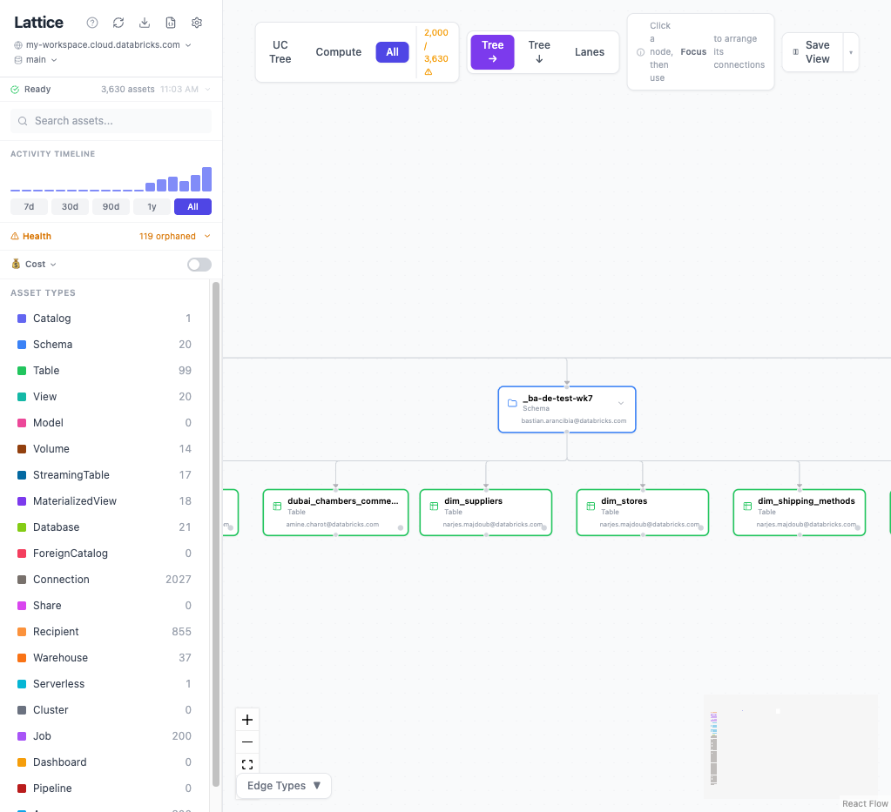
*3,630 assets mapped across 19 node types with activity timeline, health panel, and type filters.*

### Detail Panel — Asset Intelligence
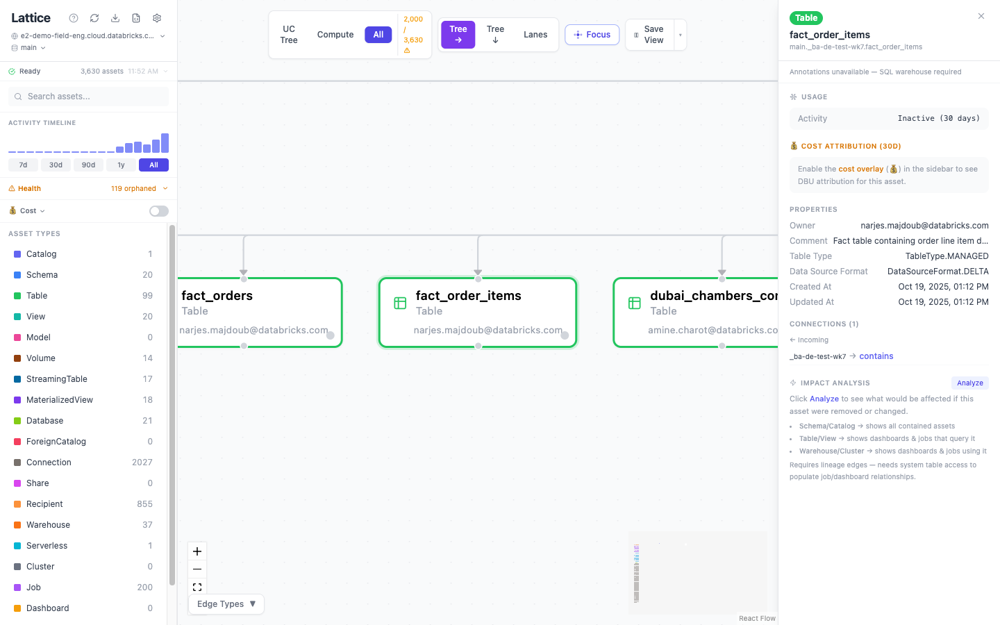
*Select any node to see properties, connections, cost attribution, and impact analysis.*

### Settings — Catalog Scope & System Access
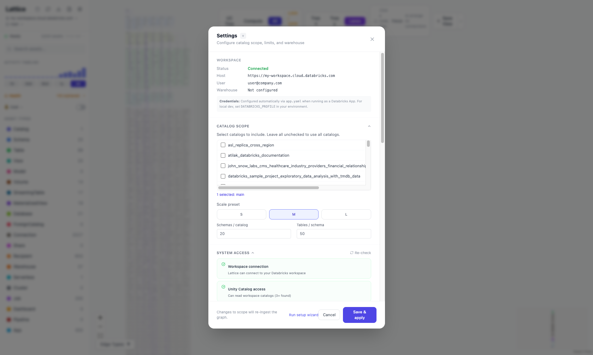
*Configure catalog scope, scale limits, and view system access pre-flight checks.*

### Swimlane Layout — Grouped by Type
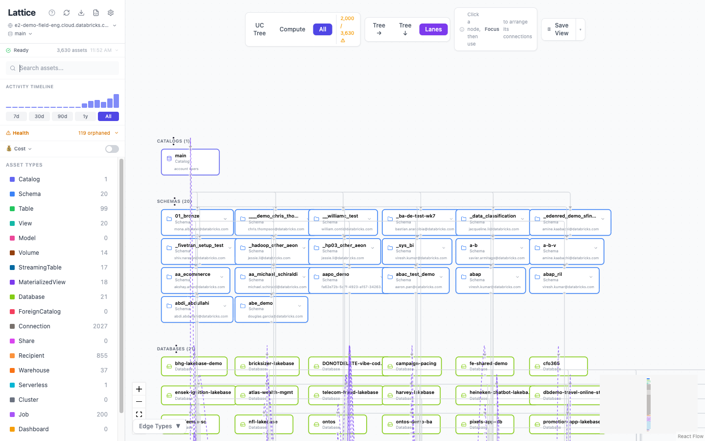
*Swimlane layout groups UC data assets, compute resources, and apps into horizontal lanes.*

### Compute View — Apps, Warehouses & Clusters
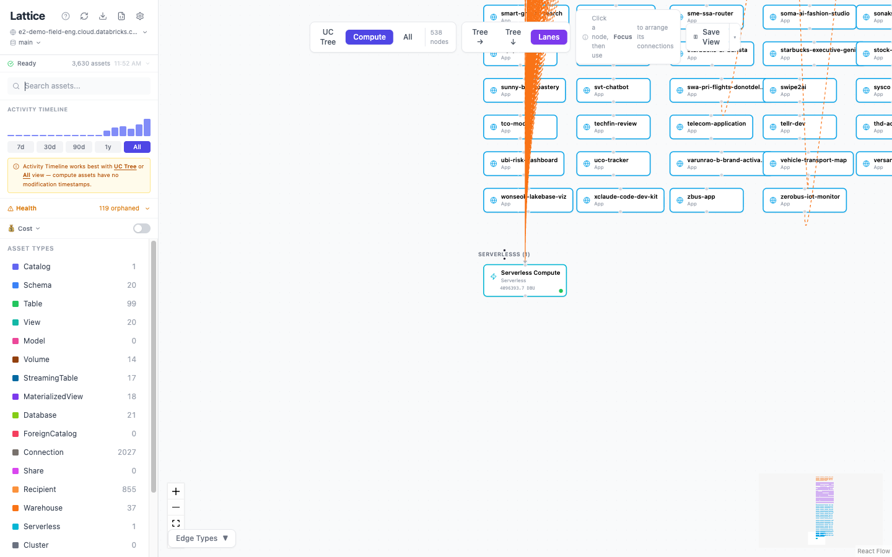
*Compute view shows Databricks Apps, SQL Warehouses, Serverless compute, and their relationships.*

### UC Tree — Catalog Hierarchy
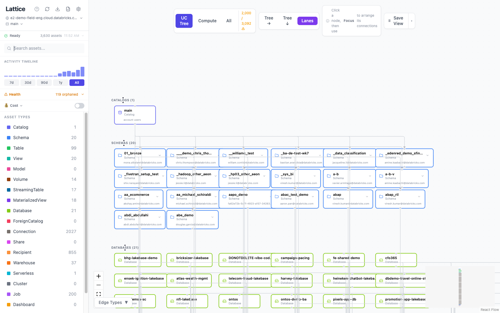
*UC Tree view shows the Catalog → Schema → Table hierarchy with heat dots and ownership.*

---

## Use Cases

### Identifying Costs — Warehouse DBU Heatmap
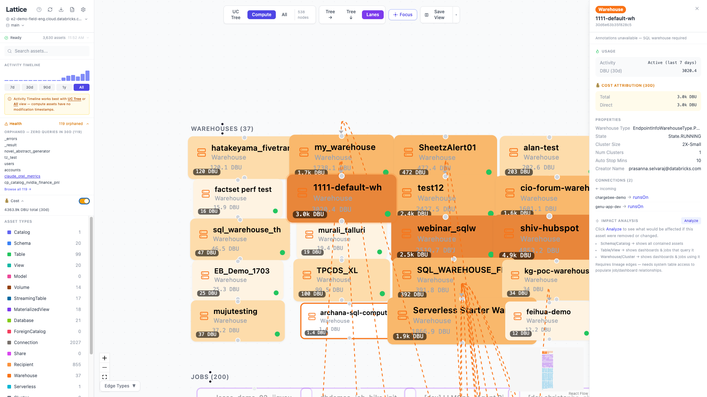
*Enable the cost overlay to see a heatmap of DBU spend across warehouses and compute. Darker orange = higher 30-day spend. Click any warehouse to see its cost attribution breakdown in the detail panel.*

### Finding Dependencies — Impact Analysis
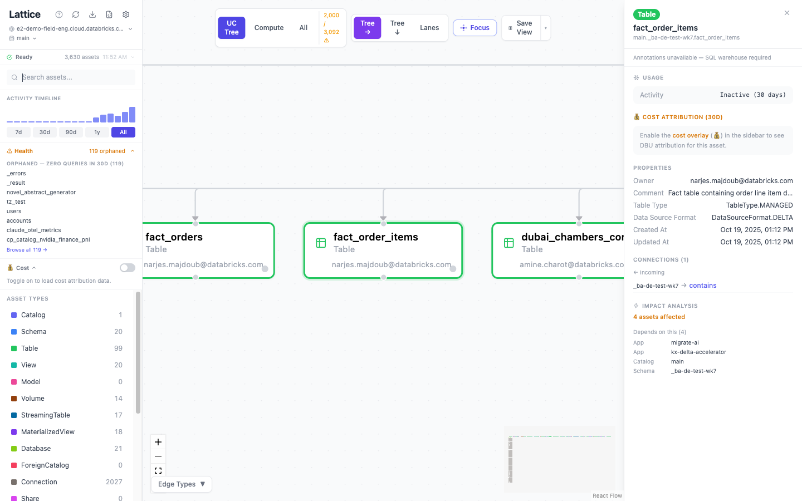
*Select any asset and click "Analyze" to see its blast radius — which schemas, apps, dashboards, and jobs depend on it. Essential before making breaking changes.*

### Exploring Connections — Focus View
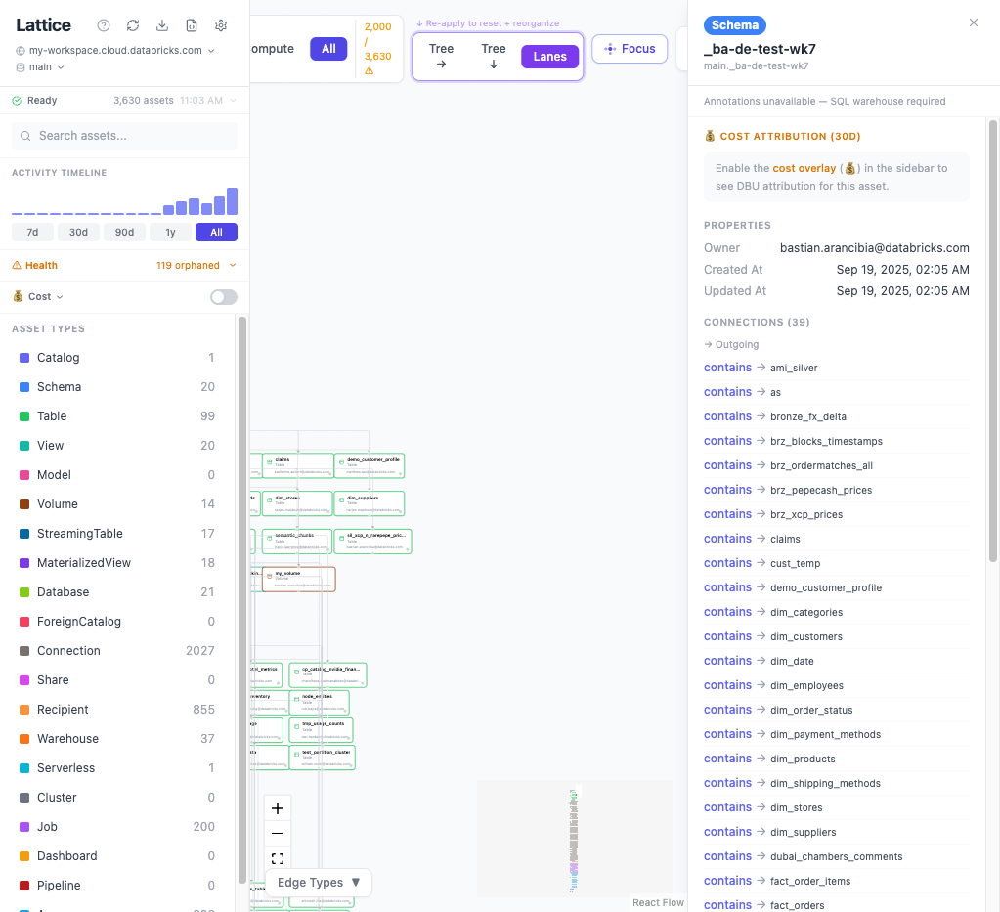
*Pull any asset out of the lane view and click "Focus" to arrange its connections — callers above, targets below. Here a single schema's 39 dependencies are isolated for analysis while the full 3,630-asset lane layout stays visible for context.*

### Filtering by Asset Type — Targeted Analysis
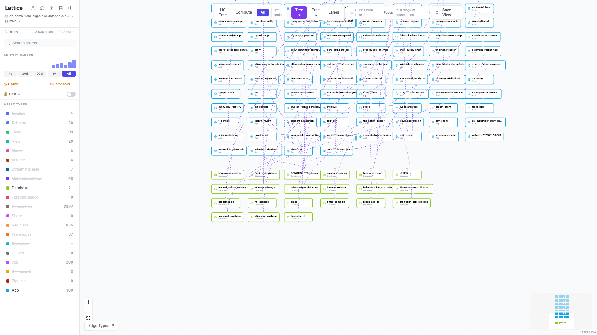
*Toggle asset types in the sidebar to isolate specific categories. Here only Apps (300) and Databases (21) are active — 321 nodes out of 3,630 — revealing the "uses" relationships between deployed applications and their backing databases.*

### Multi-Workspace & Catalog Switcher
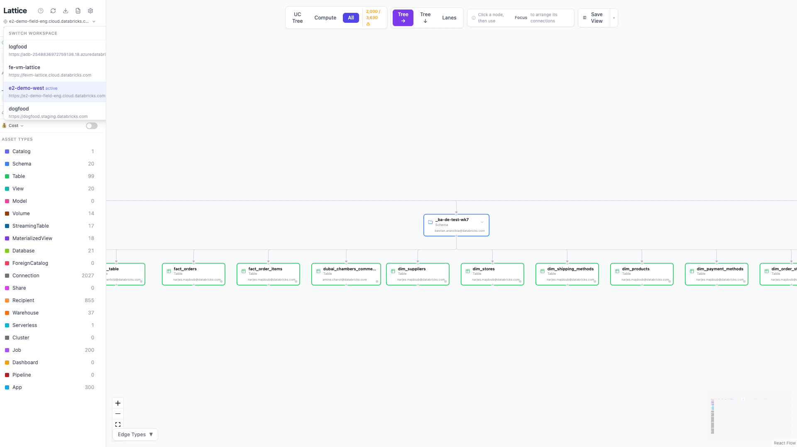
*Switch between workspace profiles to analyze different environments (dev, staging, prod) without restarting. The catalog selector below lets you scope the graph to specific catalogs — with live search across 200+ catalogs including foreign and Delta Sharing sources.*

### Save View — Export PNG, JSON & CSV
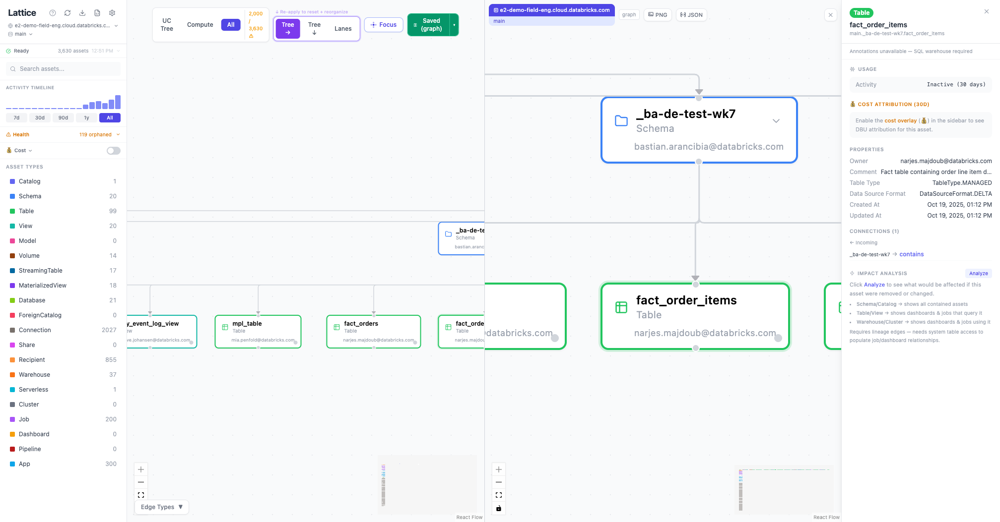
*Click "Save View" to freeze the current canvas into a side-by-side comparison pane. Export as high-resolution PNG (4x) for presentations, JSON for programmatic analysis, or CSV for a tabular export of all filtered assets — ready for spreadsheet analysis, stakeholder reviews, and cross-team collaboration.*

### Detecting Orphaned Assets — Health Panel
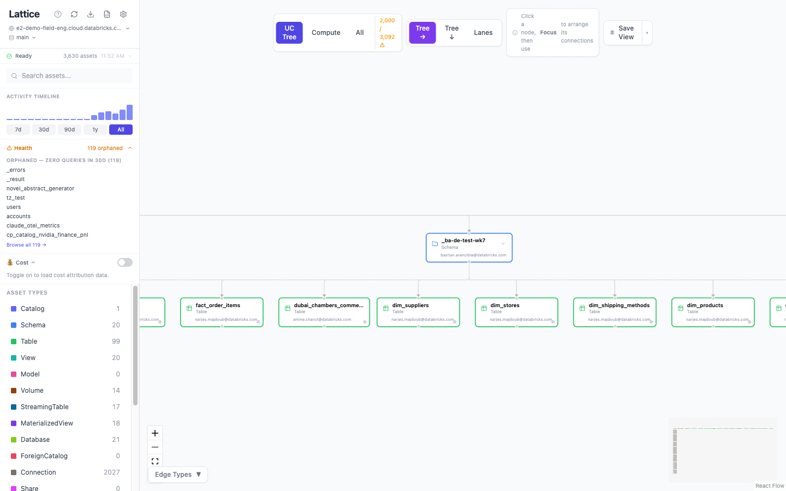
*The Health panel surfaces orphaned tables (zero queries in 30 days) and active assets with no owner. Click any item to navigate directly to it on the canvas.*

### Cost Attribution — Per-Asset Spend
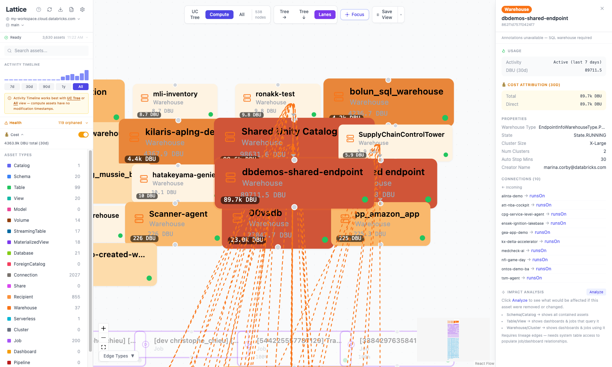
*With cost overlay enabled, every node shows its attributed DBU spend. The detail panel breaks down cost sources — which warehouses and jobs drive spend for a given table.*

### Activity Timeline — Identifying Inactive Resources
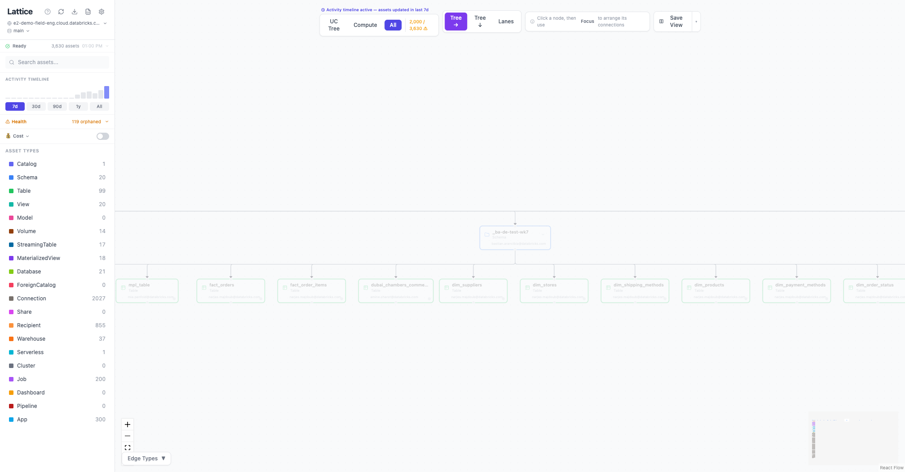
*Use the activity timeline filter (7d, 30d, 90d, 1y) to highlight recently active assets and dim inactive ones. A notification above the canvas confirms the filter is active. Dimmed nodes with dashed borders have had zero activity in the selected window — ideal for identifying stale tables, unused schemas, and candidates for cleanup.*

### Data Governance — Ownership & Compliance
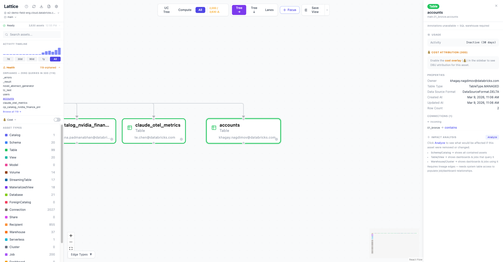
*Lattice provides a comprehensive governance toolkit for data architects and platform teams:*

- **Orphan detection** — The Health panel identifies cold tables (zero queries in 30 days) and active assets with no owner, exportable to CSV for audit workflows
- **Impact analysis** — Select any asset and click "Analyze" to see its full blast radius — every downstream schema, table, job, and dashboard that depends on it. Essential before making breaking changes
- **Activity heat classification** — Every table is classified as hot (queried in 7d), warm (7–30d), or cold (30d+) based on `system.query.history`, with heat dots visible directly on the canvas
- **Cost-aware governance** — Per-asset DBU attribution traces compute spend from warehouses and jobs through lineage to the tables and schemas that drive it, helping teams prioritize optimization and decommissioning decisions

---

## What It Does

- **Models** your workspace as a live ontology — typed entities (19 node types) with semantic relationships (10+ edge types), forming a complete platform knowledge graph
- **Discovers** every asset — catalogs, schemas, tables, views, models, volumes, warehouses, clusters, jobs, dashboards, apps, pipelines, Delta Shares, foreign catalogs, and Lakebase databases
- **Connects** them with structural, compute, lineage, and federation edges that carry meaning (contains, runsOn, queries, feedsInto, writesTo, readsFrom)
- **Enriches** with system table data — DBU spend, query frequency, heat (last-accessed age), job success rates, storage size
- **Visualizes** the ontology on an interactive canvas with multiple layout modes, search, filters, and drill-down
- **Analyzes** cost attribution, impact/blast radius, orphaned assets, and column-level lineage
- **Annotates** with persistent tags and notes backed by a Delta table
- **Exports** as JSON or JSON-LD (semantic web vocabulary) for downstream consumption by AI agents

---

## Features

### Graph & Canvas
- **19 node types:** Catalog, ForeignCatalog, Schema, Table, View, Model, Volume, StreamingTable, MaterializedView, Warehouse, Serverless, Cluster, Job, Dashboard, App, Pipeline, Connection, Share, Recipient, Database
- **10+ edge types:** contains, runsOn, queries, feedsInto, writesTo, readsFrom, triggers, uses, exposes, includes
- **3 layout modes:** Tree (top-down), Tree (left-right), Swimlane (grouped by type)
- **Schema collapse/expand** to manage large catalogs
- **Search** across name, FQN, comment, and owner
- **Type filter** sidebar to show/hide node categories
- **Freshness filter** — slider to show only assets active within N days
- **Focus Neighbors** — radial layout around a selected node with direct connections
- **Save View** — freeze canvas to a comparison pane at exact viewport/zoom
- **PNG export** (4x resolution) and **JSON export** from frozen pane
- **Console URL links** on every node — click to open in Databricks

### Intelligence
- **Heat dots** on nodes: green (hot, ≤7d), amber (warm, ≤30d), gray (cold)
- **DBU badges** — 30-day compute spend shown inline on node tiles
- **Cost overlay** — DBU attribution from compute → lineage → tables, rolled up to schema and catalog
- **Health panel** — detects orphaned tables (cold + 0 queries in 30d) and unowned assets
- **Impact analysis** — BFS traversal showing "depends on this" (consumers) and "contained within" (descendants)
- **Column lineage** — source_table.source_col → target_col, from `system.access.column_lineage`

### Lineage
- **Table lineage** from `system.access.table_lineage` — feedsInto, writesTo, readsFrom edges (blue dashed, toggleable)
- **Dashboard → Table** lineage — SQL parsed from Lakeview dataset specs; external tables create stub nodes (dashed border)
- **Column lineage** — per-column source tracing in the detail panel

### Annotations (Delta-backed)
- **Tags:** built-in (critical, pii, needs-migration, under-review, deprecated, verified) + custom
- **Notes:** free-text per asset (up to 2000 chars)
- **Bulk tagging** across multiple nodes via multi-select
- **UC tag sync** — optionally writes `lattice_`-prefixed tags back to Unity Catalog native tags
- **Persistent** — stored in `lattice.metadata.annotations` Delta table, survives redeploys

### Federation & Connected Systems
- **Foreign catalogs** (Snowflake, PostgreSQL, MySQL connections)
- **Delta Sharing** — Shares, Recipients, included tables
- **Lakebase** — Database instances linked to apps and catalogs
- **Pipelines** — DLT and Autoloader pipelines

### Multi-Workspace
- **Profile switcher** — switch between Databricks CLI profiles without restarting
- **Catalog selector** — live search with 200-limit dropdown
- **Progress polling** — non-blocking ingestion banner during workspace switch

### Export
- **JSON** — full graph with nodes, edges, and enrichment stats
- **JSON-LD** — RDF-compatible format with `@context`, `@id`, `@type` for AI agent consumption (`GET /api/export/jsonld`)

---

## Tech Stack

| Layer | Technology |
|-------|-----------|
| Frontend | React 19 + TypeScript + ReactFlow + Zustand + Tailwind CSS |
| Backend | Python 3.11+ + FastAPI + Uvicorn |
| Graph Engine | NetworkX DiGraph |
| SDK | databricks-sdk (Python) |
| Export Format | JSON-LD |
| Deployment | Databricks Apps |

---

## Quick Start — Deploy as a Databricks App

### 1. Set up GitHub access

Create a [fine-grained personal access token](https://github.com/settings/tokens?type=beta) with **Contents → Read-only** on the Lattice repo. Then add it to your Databricks workspace under **Settings → Developer → Git credentials**.

### 2. Create the app

In your Databricks workspace: **Compute → Apps → Create App**

| Setting | Value |
|---|---|
| **Name** | `lattice` |
| **Source** | Git repository |
| **Repo URL** | `https://github.com/databricks-field-eng/lattice.git` |
| **Branch** | `main` |

During setup, you'll be prompted to select a **SQL warehouse** — this injects `DATABRICKS_WAREHOUSE_ID` automatically. Pick any running warehouse (required for cost, lineage, heat, and orphan detection features).

### 3. Grant system table access

Run as workspace admin in the SQL Editor (replace `<principal>` with the app service principal):

```sql
GRANT USE CATALOG ON CATALOG system TO `<principal>`;
GRANT USE SCHEMA ON SCHEMA system.billing TO `<principal>`;
GRANT SELECT ON TABLE system.billing.usage TO `<principal>`;
GRANT USE SCHEMA ON SCHEMA system.query TO `<principal>`;
GRANT SELECT ON TABLE system.query.history TO `<principal>`;
GRANT USE SCHEMA ON SCHEMA system.access TO `<principal>`;
GRANT SELECT ON TABLE system.access.table_lineage TO `<principal>`;
GRANT USE SCHEMA ON SCHEMA system.lakeflow TO `<principal>`;
GRANT SELECT ON TABLE system.lakeflow.job_run_timeline TO `<principal>`;
```

> These grants are optional — the canvas works without them. System-table features degrade gracefully.

### 4. Open Lattice

Go to **Compute → Apps → lattice**. Once the status shows **Running**, click the app URL link next to the status badge to launch Lattice. The first-run wizard will guide you through catalog selection and system access checks.

### Alternative: Deploy via CLI

```bash
git clone https://github.com/databricks-field-eng/lattice.git && cd lattice
cd frontend && npm install && npm run build && cd ..
databricks sync . /Workspace/Users/<your-email>/lattice --profile <your-profile>
databricks apps deploy lattice \
  --source-code-path /Workspace/Users/<your-email>/lattice \
  --profile <your-profile>
```

### Run Locally

```bash
python3 -m venv .venv && source .venv/bin/activate
pip install -r requirements.txt
export DATABRICKS_PROFILE=my-workspace
python3 -m uvicorn app:app --host 0.0.0.0 --port 8000

# Frontend (separate terminal)
cd frontend && npm install && npm run dev
# Open http://localhost:5173
```

See [INSTALL.md](INSTALL.md) for full setup details including warehouse configuration options, all required grants, and environment variables.

---

## Configuration

### Environment Variables

| Variable | Default | Description |
|----------|---------|-------------|
| `DATABRICKS_PROFILE` | — | CLI profile name (local dev) |
| `DATABRICKS_HOST` | — | Workspace host URL (local dev) |
| `DATABRICKS_TOKEN` | — | PAT (local dev) |
| `DATABRICKS_WAREHOUSE_ID` | — | SQL warehouse for system table queries |
| `LATTICE_CATALOGS` | (all) | Comma-separated catalog filter |
| `LATTICE_CATALOG_LIMIT` | 20 | Max catalogs when no filter set |
| `LATTICE_SCHEMA_LIMIT` | 20 | Schemas per catalog |
| `LATTICE_TABLE_LIMIT` | 50 | Tables per schema |
| `LATTICE_MODEL_LIMIT` | 200 | Max ML models |
| `LATTICE_PIPELINE_LIMIT` | 200 | Max pipelines |
| `LATTICE_ANNOTATIONS_CATALOG` | lattice | Annotations table catalog |
| `LATTICE_ANNOTATIONS_SCHEMA` | metadata | Annotations table schema |

### In-App Settings

After first launch, configure catalog scope, limits, and warehouse in **Settings** (gear icon) — no redeploy needed.

---

## API Reference

### Graph Data
| Method | Endpoint | Description |
|--------|----------|-------------|
| GET | `/api/graph` | Full graph (nodes + edges), filtered by view mode |
| GET | `/api/nodes/{id}` | Single node + connected edges + column lineage |
| GET | `/api/nodes/{id}/descendants` | All reachable FQNs via "contains" edges |
| GET | `/api/impact?node_id={id}` | Impact analysis: consumers + contained assets |
| GET | `/api/search?q={query}` | Full-text search across name, FQN, comment, owner |
| POST | `/api/refresh` | Manual re-ingest (10s cooldown) |

### Configuration
| Method | Endpoint | Description |
|--------|----------|-------------|
| GET | `/api/config` | Current settings |
| POST | `/api/config` | Save settings (merge), triggers re-ingest if scope changed |
| GET | `/api/info` | Workspace host, catalog filter, ingestion status |
| POST | `/api/switch` | Switch profile/catalog + re-ingest (10s cooldown) |
| GET | `/api/profiles` | List available Databricks CLI profiles |
| GET | `/api/catalogs` | List catalogs with search + active filter |

### Enrichment & Health
| Method | Endpoint | Description |
|--------|----------|-------------|
| GET | `/api/progress` | Ingestion step, % complete, graph_ready flag |
| GET | `/api/status` | Pre-flight check results (warehouse, grants, features) |
| GET | `/api/health` | Orphaned & unowned asset counts |
| GET | `/api/cost` | Cost attribution summary + per-node DBU spend |

### Annotations
| Method | Endpoint | Description |
|--------|----------|-------------|
| GET | `/api/annotations` | All annotations + tag vocabulary + tag config |
| POST | `/api/annotations/{fqn}` | Upsert tags + note for a node |
| POST | `/api/annotations/bulk` | Bulk tag multiple FQNs |
| DELETE | `/api/annotations/{fqn}` | Delete annotation |

### Export
| Method | Endpoint | Description |
|--------|----------|-------------|
| GET | `/api/export` | Download graph as JSON |
| GET | `/api/export/jsonld` | Download graph as JSON-LD (AI/agent format) |

---

## Architecture

```
┌─────────────────────────────────────────────────────────┐
│                    React Frontend                        │
│  ReactFlow Canvas │ Sidebar │ DetailPanel │ Settings     │
│  Zustand Store    │ Tailwind CSS │ Lucide Icons          │
└──────────────────────────┬──────────────────────────────┘
                           │ REST API
┌──────────────────────────┴──────────────────────────────┐
│                   FastAPI Backend                         │
│                                                          │
│  ┌─────────────┐  ┌──────────────┐  ┌────────────────┐  │
│  │  Connectors  │  │ Graph Engine │  │ Annotation     │  │
│  │  (10 sources)│──│ (NetworkX)   │──│ Store (Delta)  │  │
│  └─────────────┘  └──────────────┘  └────────────────┘  │
│  ┌─────────────┐  ┌──────────────┐  ┌────────────────┐  │
│  │  Preflight   │  │ Cost         │  │ Config         │  │
│  │  Checks      │  │ Enricher     │  │ Persistence    │  │
│  └─────────────┘  └──────────────┘  └────────────────┘  │
└──────────────────────────┬──────────────────────────────┘
                           │ Databricks SDK + SQL
┌──────────────────────────┴──────────────────────────────┐
│              Databricks Workspace                        │
│  Unity Catalog │ Compute │ Jobs │ Dashboards │ System    │
│  Tables        │ Apps    │ Shares │ Pipelines            │
└─────────────────────────────────────────────────────────┘
```

### Ingestion Flow
1. Load cached graph immediately (instant canvas)
2. Fetch all connectors in parallel with 45s timeout each
3. Publish partial graph while slower connectors finish
4. Fetch system table enrichment (usage, heat, lineage, cost)
5. Build full NetworkX graph + compute cost attribution
6. Merge annotations + cache to disk

### Security
- Input validation: catalog/profile names validated against strict regex
- Rate limiting: 10s cooldown on `/api/refresh` and `/api/switch`
- Path traversal protection on all user inputs
- Generation counter prevents stale ingestion data from overwriting newer state

---

## Release Notes

### v0.4.0 — Intelligence Layer (Mar 13, 2026)
- **Health panel:** Detects orphaned tables (cold + 0 queries in 30d) and unowned assets. Collapsible sidebar section with clickable node list.
- **Impact analysis:** "Analyze" button on any node triggers BFS — shows "Depends on this" (consumers) and "Contained within" (descendants).
- **Column lineage:** Fetched from `system.access.column_lineage`, shown in detail panel as `target_col ← source_table.source_col`.
- **JSON-LD export:** `GET /api/export/jsonld` — full graph as JSON-LD with `@context`, `@id`, `@type` for AI agent consumption.
- **Terminated clusters filtered** from graph (TERMINATED, TERMINATING, ERROR states).
- **Ingestion hang fix:** Replaced blocking `ThreadPoolExecutor` context manager with explicit `shutdown(wait=False)`.
- **FitView on deselect:** Closing detail panel or clicking background animates canvas back to fit-all view.

### v0.3.0 — Security Hardening (Mar 12, 2026)
- **Input validation:** Catalog names, profile names, and host URLs validated against strict regex before use.
- **Rate limiting:** 10s cooldown on `/api/refresh` and `/api/switch` (returns 429 with retry hint).
- **Path traversal protection** on catalog/profile inputs.
- **Generation counter:** Superseded ingestion threads detect replacement and abort, preventing stale data overwrites.

### v0.2.1 — Canvas UX Improvements (Mar 12, 2026)
- **Position persistence:** Filter/type toggle changes no longer reset manual node positions.
- **Save View:** Freeze canvas to side-by-side comparison pane at exact viewport/zoom.
- **PNG export** (4x resolution) + **JSON export** from frozen comparison pane.
- **Focus Neighbors:** Radial ring layout around selected node with direct connections.
- **Profile switcher** + **Catalog selector** (live search, 200 limit, click-outside close).
- **Freshness filter:** Slider to show only nodes active within N days.
- **Multi-workspace switch** with progress polling + non-blocking IngestBanner.

### v0.2.0 — Enrichment & Lineage (Mar 11–12, 2026)
- **System table enrichment:** `system.billing.usage` (DBU 30d), `system.lakeflow.job_run_timeline` (run count + success rate), `system.query.history` (query count + last queried), `system.information_schema.table_storage_utilization` (row count + size MB).
- **Heat dots:** Green (hot ≤7d), amber (warm ≤30d), gray (cold).
- **DBU + query count** shown inline on node tiles.
- **Table lineage edges** from `system.access.table_lineage` — feedsInto, writesTo, readsFrom. Blue dashed edges, toggleable.
- **Dashboard → Table lineage:** SQL parsed from Lakeview dataset specs. External tables create stub nodes (dashed border).
- **Federation nodes:** ForeignCatalog, Connection, Share, Recipient + relationship edges.
- **Partial graph** published ~15s after startup while UC ingestion finishes.

### v0.1.0 — MVP (Mar 11, 2026)
- FastAPI backend + React/TypeScript/ReactFlow/Zustand/Tailwind frontend.
- **Unity Catalog connector:** Catalogs, schemas, tables, views, models.
- **Compute connector:** SQL warehouses + clusters.
- **Jobs connector:** Workflows with cluster_ids and serverless flag.
- **Dashboards connector:** Lakeview dashboards with warehouse_id.
- **Apps connector:** Databricks Apps + Lakebase Database instances.
- **NetworkX DiGraph** with structural, compute, and app edges.
- **Graph canvas:** Dagre hierarchical layout (tree-TB, tree-LR) + swimlane layout.
- **View modes:** UC (catalog tree only), Compute (warehouses/clusters/jobs/dashboards), All.
- **Schema collapse/expand**, node selection, zoom-to-node, zoom-to-fit.
- **Search** (name/FQN/comment/owner), type filter sidebar.
- **Console URL links** on all node types.
- **Detail panel:** Usage stats, properties, connections, referenced tables.
- **JSON export** + progress endpoint with `graph_ready` flag.
- **Disk cache** keyed by profile+catalog filter — loaded on startup for instant canvas, then refreshed live.

---

## Roadmap

| Phase | Scope | Status |
|-------|-------|--------|
| 1 | MVP: connectors, graph, canvas, search, export | Done |
| 2 | System table enrichment + lineage edges | Done |
| 3 | Security hardening + ingestion stability | Done |
| 4 | Intelligence: health, impact analysis, column lineage, JSON-LD | Done |
| 5 | First-run wizard, permissions checker, settings, bundle packaging | Done |
| 6 | Ontology writeback: edit owner, description, tags inline → write back to UC. Draft/publish workflow with diff view. Closes the loop from read-only ontology to actionable platform management | Planned |
| 7 | MCP server: expose graph as Claude tool (search, lineage, impact, orphans) | Planned |
| 8 | Multi-workspace, RBAC, upgrade path, telemetry | Planned |
| 10 | Annotation & Bookmarking: tags, notes, canvas dots, tag filter, multi-select, UC sync | Designed |

---

## Project Structure

```
lattice/
├── app.py                       # FastAPI entry point, ingestion orchestration
├── app.yaml                     # Databricks App deployment manifest
├── databricks.yml               # Databricks bundle configuration
├── requirements.txt             # Python dependencies
├── lattice_config.json          # User-persisted settings (excluded from sync)
├── INSTALL.md                   # Installation guide
├── TROUBLESHOOTING.md           # Diagnostics & common issues
├── server/
│   ├── config.py                # Workspace client setup, config I/O
│   ├── preflight.py             # Pre-flight permission checks
│   ├── api/
│   │   └── routes.py            # All API endpoints
│   ├── connectors/
│   │   ├── unity_catalog.py     # UC catalogs, schemas, tables, models, volumes
│   │   ├── compute.py           # Warehouses, clusters
│   │   ├── jobs.py              # Jobs (serverless + cluster-bound)
│   │   ├── dashboards.py        # Lakeview dashboards + table lineage
│   │   ├── apps.py              # Databricks Apps, Lakebase databases
│   │   ├── federation.py        # Connections, Delta Shares, Recipients
│   │   ├── pipelines.py         # DLT, Autoloader pipelines
│   │   └── system_tables.py     # System table queries
│   └── graph/
│       ├── builder.py           # Builds NetworkX graph from all sources
│       ├── schema.py            # Node colors & icons
│       ├── annotation_store.py  # Delta-backed tags & notes
│       └── cost_enricher.py     # DBU spend attribution
├── frontend/
│   ├── package.json
│   ├── vite.config.ts
│   ├── src/
│   │   ├── App.tsx              # Root component
│   │   ├── stores/graphStore.ts # Zustand state management
│   │   ├── components/
│   │   │   ├── Canvas/          # ReactFlow graph + layouts
│   │   │   ├── Sidebar/         # Search, filters, health panel
│   │   │   ├── DetailPanel/     # Asset details, annotations, lineage
│   │   │   ├── SettingsPanel/   # Config, warehouse, catalog scope
│   │   │   ├── FirstRunWizard/  # Onboarding
│   │   │   ├── FreshnessFilter/ # Age filter
│   │   │   ├── IngestBanner/    # Progress indicator
│   │   │   └── EdgeLegend/      # Relationship type legend
│   │   ├── types/               # TypeScript interfaces
│   │   ├── utils/               # Helpers (cost colors, etc.)
│   │   └── constants/           # Tag config, display constants
│   └── dist/                    # Built output
```

---

## Troubleshooting

See [TROUBLESHOOTING.md](TROUBLESHOOTING.md) for common issues including:
- Blank canvas on load
- Missing usage stats or heat dots
- Empty UC tree
- Warehouse not found
- System table permission errors

---

## Known Limitations

- Column-level cost attribution not yet supported (table-level only)
- Stub table nodes (from cross-catalog dashboard queries) have no visual legend
- Health panel orphan detection requires `system.query.history` access
- Column lineage requires `system.access.column_lineage` grant — silently returns empty if unavailable
- File-based JSON caching (not distributed)
